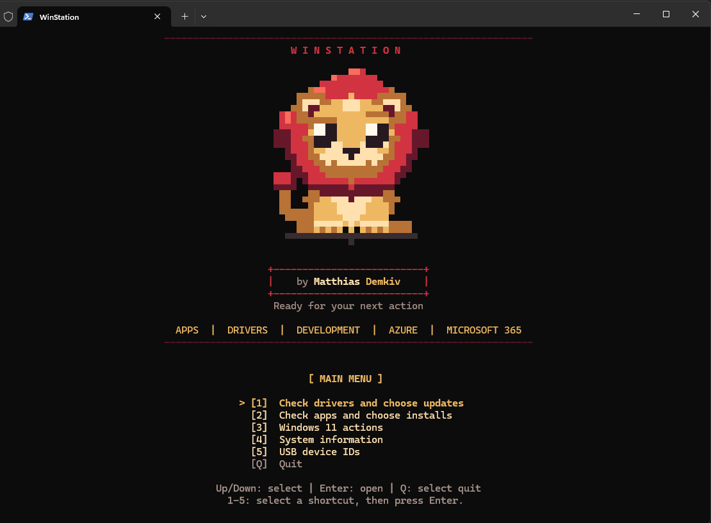
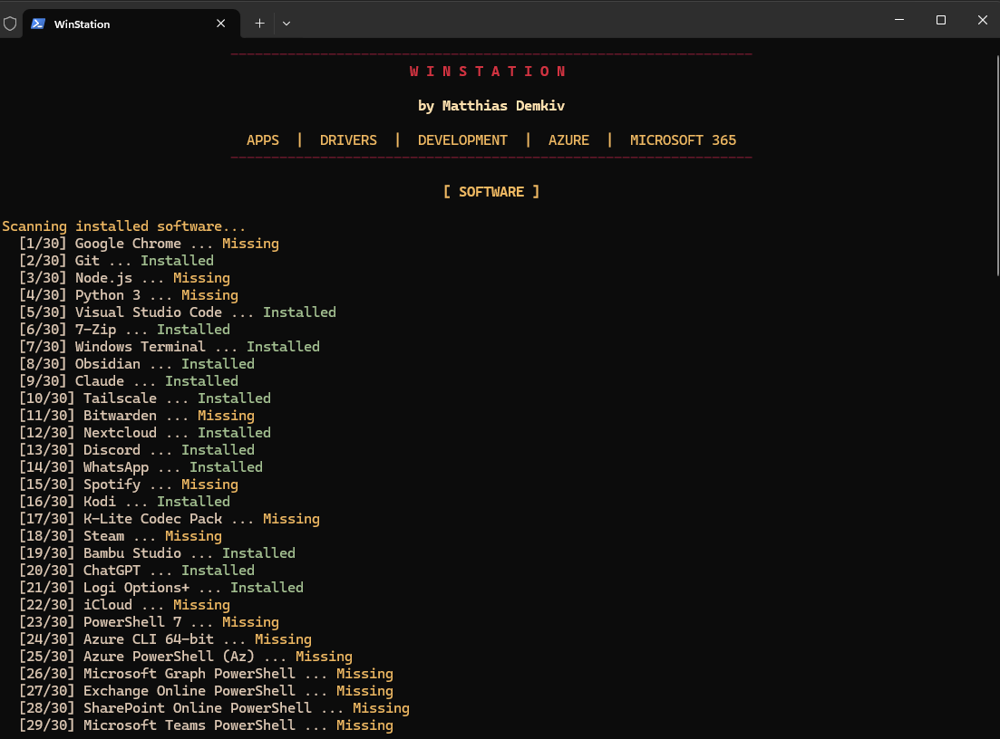
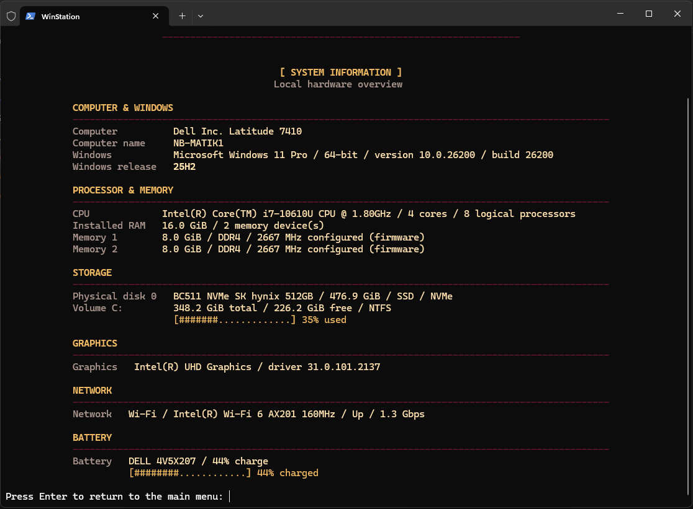
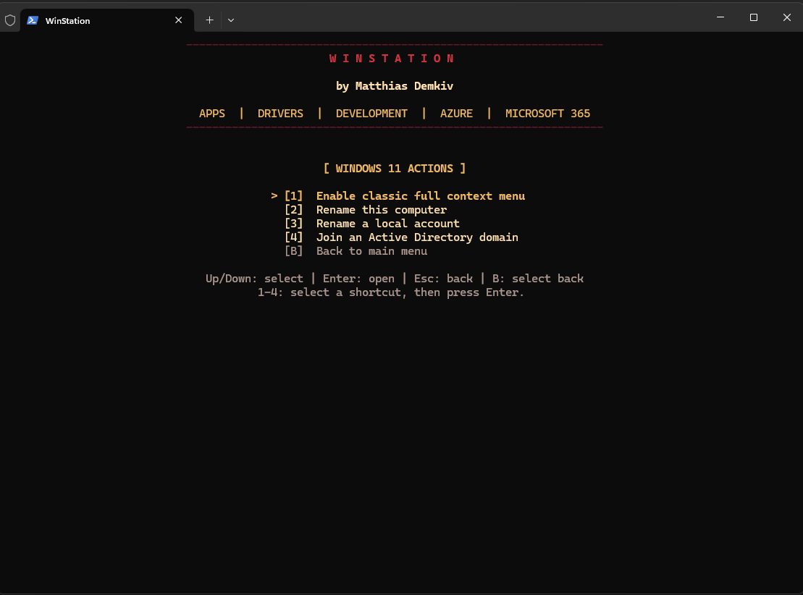
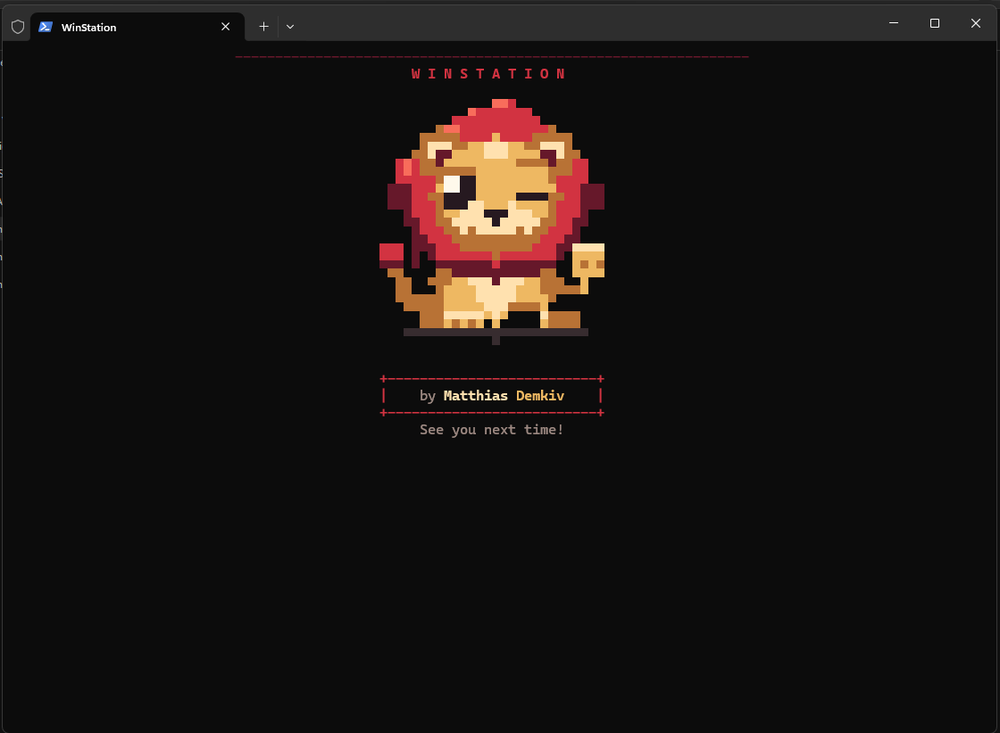

# WinStation

WinStation is an interactive PowerShell setup wizard for Windows workstations.
It is built for preparing a new or freshly reinstalled PC, but it is also useful
when an existing machine just needs missing apps, drivers, or a quick system
check.

The script stays practical: open a menu, check what is missing, choose what to
install, and keep control of the process.

## Screenshots











## What It Does

- Checks common apps in a live list and lets you choose which ones to install.
- Checks available driver updates and lets you choose which ones to install.
- Shows installation progress and a clear result for each selected app.
- Provides selected Windows 11 actions.
- Shows local system information such as Windows release, CPU, RAM, disks,
  network adapters, GPU and battery details.
- Shows USB storage device IDs for manual Intune or Defender policy work.
- Can be carried on a USB drive and launched with a BAT file.

Opening WinStation does not start installing software or drivers. The wizard
opens a menu first. Installation steps require an explicit selection in the
interactive flow.

App checks distinguish missing software from items that could not be checked.
Only confirmed missing items are offered for installation. If selected modules
need PowerShell 7, it is added to the plan before confirmation.

Driver bulk selection excludes recognized BIOS/firmware updates and updates
without a driver class. These require individual selection; recognized firmware
also requires a separate confirmation. Identification depends on publisher
metadata, so review the selected updates before installing.

## Run WinStation

From PowerShell:

```powershell
powershell.exe -NoProfile -ExecutionPolicy Bypass -File ".\WinStation.ps1"
```

Or use the portable launcher:

```text
Run-WinStation.bat
```

The launcher opens an elevated PowerShell window through the standard Windows
UAC prompt. It does not bypass UAC, security policies, or administrator
requirements.

## Portable USB Use

Copy these files into one folder on a USB drive:

- `Run-WinStation.bat`
- `WinStation.ps1`

Double-click `Run-WinStation.bat` and approve the Windows UAC prompt. Keep the
USB drive connected while the wizard runs. Software and driver downloads require
internet access.

## Safety Notes

- No scan starts automatically when the script opens.
- Software installation is selected from the app check workflow.
- Driver installation is selected from the driver check workflow.
- Windows actions are chosen from their own menu.
- USB device ID view is read-only and does not contact Intune.
- The script does not change permanent PowerShell execution policy settings.
- The BAT launcher only starts the PowerShell script as administrator.

Some actions require administrator rights because Windows requires them. A
standard user will need valid administrator credentials.

## Menu

Use the Up/Down arrow keys to select an option and Enter to open it. Q selects
Quit and B selects Back; press Enter to confirm. Number shortcuts work the same
way. In small windows or hosts without keyboard navigation, type a number or Q
and press Enter.

```text
[1] Check drivers and choose updates
[2] Check apps and choose installs
[3] Windows 11 actions
[4] System information
[5] USB device IDs
[Q] Quit
```

## Customization

The software list is intentionally simple to edit. Apps are defined in the
catalog in `WinStation.ps1`; search for `CUSTOMIZE THE SOFTWARE CATALOG HERE`.

See [CUSTOMIZE.md](CUSTOMIZE.md) for examples showing how to add, remove,
rename, or move apps between categories.

## Additional Notes

See [WinStation.md](WinStation.md) for details about command-line switches,
the audit-only `-WhatIf` mode, terminal behavior and validation.

## Disclaimer

WinStation is a personal workstation setup helper. Review the script before
running it on production or managed devices, especially in environments with
strict software, driver, or endpoint-management policies.
